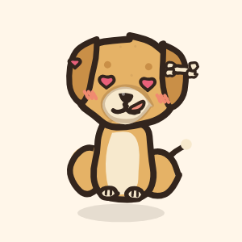
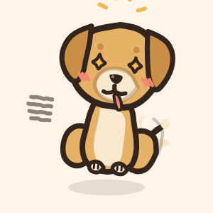
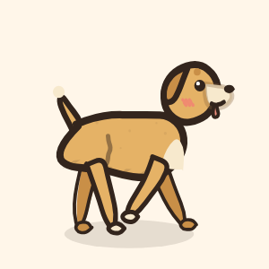
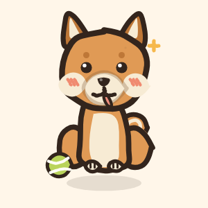
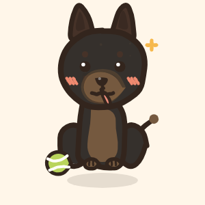
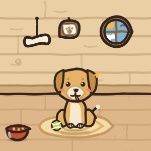
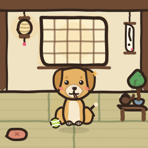
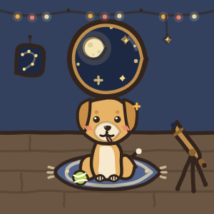
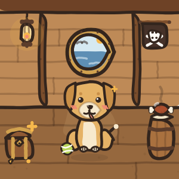

<div align="center">


# Maika

**A hand-drawn buddy who lives on your Mac.**

*Drawn in code. Raised on your desk.*

<br/>


<a href="LICENSE"></a>

<br/><br/>

|  |  |  |  |  |
|:---:|:---:|:---:|:---:|:---:|
| Signature | Joy | Yum | Sleepy | Hype |

</div>

## What is this?

A macOS desktop pet built with Flutter, free and open source under the MIT
license. Maika floats above every window in a borderless transparent panel,
breathes, blinks, wags, does tricks when you tap her, flies with real physics
when you flick her, walks across the screen with a drawn four-leg gait, plays
actual fetch, and levels up from your real Claude Code usage. She also keeps an
eye on your terminals and barks, politely, when one of them needs you.

Every frame of her is drawn in code with a wobbling ink line, like cel
animation. No character art ships with the app, no sprite sheets, just paths and
a menu bar icon. The renders in `art/` and on the
[landing page](https://maikadog.vercel.app) are the engine's own output.

**Nothing is for sale.** There is no Pro tier, no license key, no account and no
payment of any kind. Everything is earned by using her: coats, breeds, fits and
rooms unlock as you level up, and the only currency is work you were doing
anyway.

## Install

Download `Maika.dmg` from the [latest release](https://github.com/joewrdd/MaikaDog/releases/latest)
and drag **Maika** into **Applications**.

The first launch will be refused, because this build is not signed with a paid
Apple Developer ID. Open **System Settings → Privacy & Security**, scroll to the
bottom, and click **Open Anyway** next to Maika. That is a one-time step.

She appears bottom-right and adds a paw to your menu bar. There is no Dock icon
on purpose, she is an agent app. If you would rather build her yourself, see
[Build from source](#build-from-source).

## The pet, briefly

- **Alive at cel speed.** Boiling ink lines, breath, blinks, a permanently wagging tail, all rendered at hand-drawn framerates, on twos.
- **A real little roommate.** Tap for the Ball Toss. Drag her anywhere. Flick her and she flies, bounces, and lands with a squash. Hold her for heart eyes. She asks for her name on first launch, sleeps after 11pm, greets you in the morning, warns on low battery, and offers stretch breaks.
- **She walks.** The front view turns through a drawn three-quarter key into a full side profile, does a play-bow stretch, and trots off. Turning back happens the same honest way.
- **Real fetch.** Flick the tennis ball and she bolts after it, snatches it up, and trots it back to your cursor.
- **Summon her** from anywhere with ⌥⌘M, or from the menu bar paw, where the focus timer, ghost mode, mood pinning and launch at login also live.

<div align="center">

|  |  |
|:---:|:---:|
| The trot | The bark |

</div>

## Levels, coats, breeds

Token counts are read locally from the Claude Code transcripts already in
`~/.claude` and become XP. Nothing is uploaded, there is no account, and she
works offline.

**Fifty levels, ninety-one things to earn.** Every coat, every breed, all
thirty two fits and all sixteen dens sit somewhere on the ladder, and almost
every single level hands you something. You start with a kennel, a golden coat
and a couple of simple fits; six more breeds join the desk along the way, and
the Galaxy coat and the Pirate Galley wait at the top. Level-ups trigger a
celebration performance and a bubble naming what unlocked. Past 50 she keeps
counting. Everything is earned by using her, and nothing can ever be bought.

<div align="center">

|  |  |  |  |  |  |  |
|:---:|:---:|:---:|:---:|:---:|:---:|:---:|
| Golden | Shiba Lv 8 | Corgi Lv 14 | Husky Lv 20 | Dachshund Lv 27 | Poodle Lv 35 | Malinois Lv 44 |

</div>

## The sidekick

She watches the session transcripts change and turns file growth into a story:

- **Names, not noise.** A session is labeled by its folder, then folder plus branch, then a numbered seat, so five terminals never look alike. Your prompts are never shown, ever.
- **The moment it matters.** She announces when a long run finishes, barks softly when a session sits waiting on your input while you are in another app, and warns before a session needs a compact. She learns the real auto-compact ceiling from the transcripts themselves and stays quiet while you are already at the terminal.
- **Real, not guessed.** She checks which sessions are genuinely running, so a session you closed leaves the board and one you left open sits there resting instead of vanishing.
- **The activity board.** Right-click her for the last word on every session: still working, waiting for you, done, resting, or hit an error, each with how long ago and how full its context is.

## The wardrobe

Thirty two hand-inked fits across headwear, eyewear, neckwear, extras and a
shelf of legends, drawn for all three views of the turn. The legends shelf is
ten heroic getups — cloaks, masks, blindfolds, crossed swords and a captain's
hat — drawn for days that call for a little more main character. Fits arrive as
you level, the plain ones early and the legends deep in the climb.

<div align="center">

|  |  |  |  |
|:---:|:---:|:---:|:---:|
| Party hat | Heart shades | Ghoul mask | Blindfold |

</div>

## The den

Take her home from the menu bar and the window becomes a little room with her
inside. Sixteen hand-drawn interiors: six everyday homes (a cozy kennel, a paper
teahouse, a star cabin, a beach hut, a reading nook, a bakery corner) and ten
legend rooms that match the wardrobe fits, from a skull banner hideout and a
shadow gate with eyes in the arch to a round homestead with a glowing orb and a
galley under a pirate flag. The kennel is yours from the start and the rest
unlock as you climb.

<div align="center">

|  |  |  |  |
|:---:|:---:|:---:|:---:|
| Cozy Kennel | Paper Teahouse | Star Cabin | Pirate Galley |

</div>

## The yard

Open the den door and nearby Maikas can come over. Rooms are pure peer to peer
over MultipeerConnectivity: Bluetooth plus direct WiFi, encrypted sessions, no
server, no accounts, nothing stored. A guest knocks, the host approves, and
their dog walks into the host's house with a name tag, wearing whatever coat,
breed and fit they own. Dogs travel as a few dozen bytes of drawing
instructions and every Mac redraws its guests with its own ink engine. Up to
six dogs a room; the window widens into a yard while company is over, and the
host can send anyone home. Every incoming byte is validated against the real
registries with safe fallbacks, floods are throttled per peer, and silent dogs
walk out on their own.

## Privacy

Maika reads your Claude Code transcripts, so it is fair to ask what she does
with them. The honest answer, in full, is in [SECURITY.md](SECURITY.md).

The short version: **she never contacts a server.** No analytics, no telemetry,
no crash reporting, no update check, no account, no HTTP client anywhere in the
app. She reads token counts, timestamps and tool names from `~/.claude` and
keeps a small local ledger of counts. **She never displays your prompt text** —
sessions are named by folder, branch and a numbered seat.

The one thing that touches a network is the Yard, and only when you open the
door: she announces herself over Bonjour so nearby Macs can find her, then
trades cosmetic descriptions of your dog directly with them. macOS will ask for
Local Network permission the first time. The door is closed until you open it.

Don't take my word for it. `test/no_network_test.dart` fails the build if a
networking API or an unvetted dependency ever appears, and SECURITY.md lists the
commands to check the rest yourself.

## How she is drawn

Everything is Flutter `CustomPainter` paths pushed through a small hand-ink layer (`lib/characters/core/sketch.dart`):

- **Wobble.** Paths are resampled and nudged so no line is ever ruler-straight.
- **The boil.** The wobble seed re-rolls a few times a second, so still frames shimmer like ink on paper.
- **Misregistered fills.** Color sits slightly off the line, like a print that missed registration.
- **Cel timing.** Movement is quantized to animation framerates instead of gliding at 60fps.
- **Three drawn views.** Front, three-quarter and profile are separate drawings, and the turn squashes through the thinnest point to swap between them, the way a cel animator would cheat it.

`lib/characters/dogs.dart` parameterizes one dog into every breed, coat, accessory and view.

## Project layout

| Path | What lives there |
|---|---|
| `lib/buddy_brain.dart` | App state: moods, physics, wander, fetch, tray menu, XP, the panels |
| `lib/buddy_shell.dart` | The window: gestures, cel ticker, morphs, dashboard, field notes and activity board UI |
| `lib/sidekick.dart` | Session watching: transcript scanning, live process checks, labels, completion, waiting, errors, context watch |
| `lib/yard.dart` | Peer to peer rooms: protocol, validation, rate limits, the room model and autopilot |
| `lib/usage_tracker.dart` `lib/progression.dart` | The local XP ledger and the level curve |
| `lib/characters/` | The ink engine, every drawn character and all sixteen houses |
| `test/` | Render tests that output real frames to `build/maika_previews/`, sidekick fixture tests, and the no-network guarantee |
| `make_dmg.sh` | Packages `dist/Maika.dmg` |

## Build from source

You need macOS 13+, [Flutter 3.44](https://docs.flutter.dev/get-started/install/macos)
(Dart 3.12), Xcode with command line tools, and CocoaPods. No Apple Developer
account and no team ID are required.

```bash
git clone https://github.com/joewrdd/MaikaDog.git
cd MaikaDog
flutter run -d macos      # run from source
flutter test              # gates + renders preview frames and the app icon
flutter build macos --release
./make_dmg.sh             # dist/Maika.dmg
```

The window is borderless, transparent and floating
(`macos/Runner/MainFlutterWindow.swift`), and the sandbox is deliberately off so
she can read `~/.claude` on your own machine.

## Contributing

Ideas, fits, rooms and fixes are all welcome — see
[CONTRIBUTING.md](CONTRIBUTING.md) for the few things about this codebase that
will surprise you (everything is drawn in code, there are no image assets, and
nothing may touch the network). Be kind to each other:
[Code of Conduct](CODE_OF_CONDUCT.md).

## Credits

Drawn, written and maintained by [@joewrdd](https://github.com/joewrdd).

The legends shelf and the rooms that match it are original drawings, made in
the spirit of stories worth loving. They are not affiliated with or endorsed by
any rights holder.

## License

[MIT](LICENSE) — do what you like with the code, including commercially.

The name **Maika**, the app icon, and the dog design are the author's. If you
fork this and ship it, please give your version its own name and face.

---

<div align="center">

*Nothing about your work leaves your Mac. Maika just watches you be productive and finds it deeply impressive.*

**© WrddIO 2026 · MIT**

</div>
